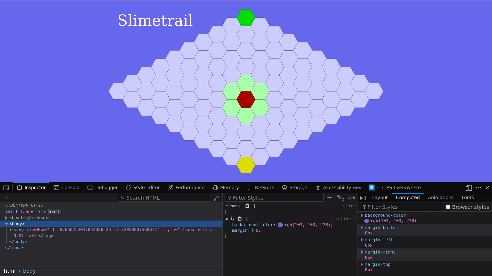
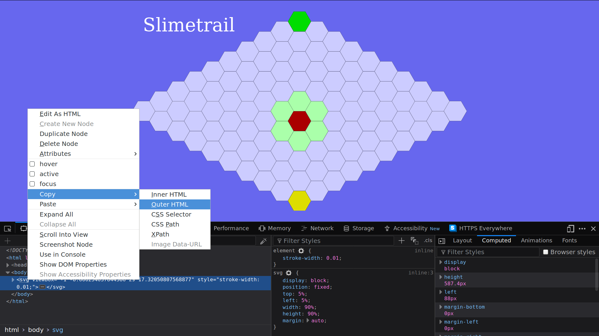

# Playing with the Document Object Model (DOM)

It is time to meet the [DOM](https://developer.mozilla.org/en-US/docs/Web/API/Document_Object_Model). First open the page [chrilves.github.io/slimetrail](https://chrilves.github.io/slimetrail) on which you played in the last section. Then **open the development tools**. In [Firefox](https://www.mozilla.org/en-US/firefox/new/), you can do so by opening the `Web Developer -> Toggle Tools` menu item. You should see something like this:



The bottom half of the screen is [the Web Developer Tools](https://developer.mozilla.org/en-US/docs/Tools).

## The **Inspector** panel

- **Recommended time to spend on this part: 10 minutes**
- **Recommended finishing before: 9:15am**

The **inspector** shows you the *HTLM/CSS/SVG* code of the page **in real time**. *JavaScript* code can modify the *HTLM/CSS/SVG* code of the page through an *API* (Application Programming Interface) known as the [Document Object Model](https://developer.mozilla.org/en-US/docs/Web/API/Document_Object_Model) or **DOM** for short.

- **Play the game and watch the code of the page being modified as you play.**
- **Write down 10 modifications of the tree you noticed.**

Within the *inspector* you can explore the structure of the document, but also modify it and even copying it.

- **Select the** `<svg ...>` **tag, then right-click and select** `Copy -> Outer HTML` **like this:**



- **Paste it any text editor you like**.

During this session, use the *inspector* **often** either to inspect a working example like the one at [chrilves.github.io/slimetrail](https://chrilves.github.io/slimetrail), or as a *REPL* by writing down *HTML/CSS/SVG* or as a debugger.

## The **console** panel

- **Recommended time to spend on this part: 30 minutes**
- **Recommended finishing before: 9:45am**

The **console** panel is a *JavaScript* [REPL](https://en.wikipedia.org/wiki/Read–eval–print_loop). Enter the following *JavaScript* code and watch the effects on the page:

```js
let x = "Welcome ";
x;
```

```js
x = x + "to the console";
```

```js
console.log(x);
```

```js
document.body
        .appendChild(document.createTextNode("Hello"));
```

The structure of the page, exposed in the **inspector** panel, is (more or less) an **XML tree** made of [Node](https://developer.mozilla.org/en-US/docs/Web/API/Node). There are different kind of nodes such
as [Text](https://developer.mozilla.org/en-US/docs/Web/API/Text) nodes which are leaves representing some text or [Element](https://developer.mozilla.org/en-US/docs/Web/API/Element) nodes which represent an *HTML* or *SVG* tag such as `div`, `span`, `body`, `svg` and many others. As you can see in the inspector [Element](https://developer.mozilla.org/en-US/docs/Web/API/Element) nodes can have sub-nodes that are called children and **key/value** pairs attached to them called [Attributes](https://developer.mozilla.org/en-US/docs/Web/API/Element/attributes). We will only use `Text` and `Element` nodes in this session.

One of the most important concept is the [document](https://developer.mozilla.org/en-US/docs/Web/API/Document), it represents the page. You can access it simply with `document`. It provides many of the main functions we will use:

- [document.getElementById](https://developer.mozilla.org/en-US/docs/Web/API/Document/getElementById) get an `Element` node by its `id` attribute.

  **Try the following code in the console. Observe the result and find the node in the inspector:**

  ```js
  let rules = document.getElementById("rules");
  rules;
  ```

- [document.createTextNode](https://developer.mozilla.org/en-US/docs/Web/API/Document/createTextNode) creates a `Text` node but does not attach it to the page yet!

  **Try the following code in the console. Observe the result and try to find it in the inspector:**

  ```js
  let mytextnode = document.createTextNode("I am a text node");
  mytextnode;
  ```

- [element.appendChild](https://developer.mozilla.org/en-US/docs/Web/API/Node/appendChild) add a node to the children of the element.

  **Try the following code in the console. What change do you see on the page? Find the** `mytextnode` **in the inspector:**

  ```js
  rules.appendChild(mytextnode);
  ```

- [element.replaceChild](https://developer.mozilla.org/en-US/docs/Web/API/Node/replaceChild) replace a node that is a child of the element by another node.

  **Try this in the console:**

  ```js
  let mynewtextnode = document.createTextNode("I am the new text node");
  rules.replaceChild(mynewtextnode, mytextnode);
  ```

  **Observe the effect on the page. Using the inspector, notice what happend.**

- [document.createElementNS](https://developer.mozilla.org/en-US/docs/Web/API/Document/createElementNS) creates a new `Element` node but does not attach it to the page yet. Note that this function requires an argument called the **namespace**. A tag may have several meaning depending on the context, how does the browser know how to interpret it? Take a `address` tag for example, is it a postal address? Or an email address maybe? To avoid ambiguity, we can make clear what is the meaning of a tag by defining its **namespace**. We will use two namespaces in this session:

  - The *HTML* namespace tells the browser the node is to be interpreted as an *HTML* node. Its value is `"http://www.w3.org/1999/xhtml"`.
  - The *SVG* namespace tells the browser the node is to be interpreted as an *SVG* node. Its value is `"http://www.w3.org/2000/svg"`.

  Using the *HTML* namespace for a *SVG* node will result in the browser treating it as an *HTML* node and thus misbehaving. **Be very careful about that, always give the correct namespace.**

  **Try the following code in the console. Add the element to the page and observe the result in the inspector:**

  ```js
  let myhtmlelement =
        document.createElementNS("http://www.w3.org/1999/xhtml", "h1");
  myhtmlelement;
  ```

  **Try the following code in the console. Add the element to the page and observe the result in the inspector:**

  ```js
   let mysvgelement =
        document.createElementNS("http://www.w3.org/2000/svg", "polygon");
   mysvgelement;
   ```

- [element.setAttributeNS](https://developer.mozilla.org/en-US/docs/Web/API/Element/setAttributeNS) set an attribute on the `element`. Attributes can also have a *namespace* but unlike *elements* it is optional.

  **Try the following code in the console. Observe the effects on** `myhtmlelement` **in the inspector.**

  ```js
  myhtmlelement.setAttributeNS(
          undefined,
          "akey",
          "avalue");
  myhtmlelement;
  ```

  ```js
  myhtmlelement.setAttributeNS(
          undefined,
          "akey",
          "newvalue");
  myhtmlelement;
  ```

  ```js
  myhtmlelement.setAttributeNS(
        "http://www.w3.org/1999/xlink",
        "xlink",
        "anothervalue");
  myhtmlelement;
  ```

- [Node.parentNode](https://developer.mozilla.org/en-US/docs/Web/API/Node/parentNode) returns the parent node if it exists.

  **Try the following code in the console. Find the parent node in the inspector.**

  ```js
  let rulesParent = rules.parentNode;
  rulesParent;
  ```

- [Node.addEventListener](https://developer.mozilla.org/en-US/docs/Web/API/EventTarget/addEventListener) attach a reaction to an event on this node.

  **Try the following code in the console. Then click on the page to observe the result.**

  ```js
  function reaction1(event) {
    alert("Event received and reaction triggered!");
  }
  document.body.addEventListener("click", reaction1);
  ```

- [Event.stopPropagation](https://developer.mozilla.org/en-US/docs/Web/API/Event/stopPropagation) prevents further propagation of the current event in the [capturing and bubbling phases](https://developer.mozilla.org/en-US/docs/Learn/JavaScript/Building_blocks/Events).

  ```js
  function reaction2(event) {
    event.stopPropagation();
    alert("Event received, reaction triggered but no further propagation!");
  }
  document.body.addEventListener("click", reaction2);
  ```

- By default, *JavaScript* code in a page can be executed before the page is fully loaded. Code that need the page to be fully loaded can set themselves as an event listener on `document` for the [DOMContentLoaded](https://developer.mozilla.org/en-US/docs/Web/Events/DOMContentLoaded) event.

  ```js
  function reaction3(event) {
    alert("I will be executed when the page is fully loaded");
  }
  document.addEventListener("DOMContentLoaded", reaction3);
  ```

These are the few functions you need to use to create or modify the page structure from *JavaScript*.

## Real-Life Application

- **Recommended time to spend on this part: 10 minutes**
- **Recommended finishing before: 9:55am**

It is about time to apply all this knowledge into a real-life example. To do so, create a new file named `example.html` whose content is:

```html
<!DOCTYPE html>
<html>
  <head>
    <meta charset="UTF-8">
    <script type="text/javascript">
    /* Place here the code that create the svg tree
       and add it to the page so that the image is
       displayed by the browser.
    */
    </script>
  </head>
  <body>
  </body>
</html>
```

**Write within the** `<script ...>` **tag above the *JavaScript* code to create the following complete *Element* and append it to the** `<body>` **node so that the browser displays the image.** This example is taken from the book [SVG Essentials](http://shop.oreilly.com/product/0636920032335.do).

```html
<svg width="140"
     height="170"
     xmlns="http://www.w3.org/2000/svg"
     xmlns:xlink="http://www.w3.org/1999/xlink">

  <title>Cat</title>
  <desc>Stick Figure of a Cat</desc>
  
  <circle cx="70" cy="95" r="50" style="stroke: black; fill: none;"></circle>
  <circle cx="55" cy="80" r="5" stroke="black" fill="#339933"></circle>
  <circle cx="85" cy="80" r="5" stroke="black" fill="#339933"></circle>
  
  <g id="whiskers">
    <line x1="75" y1="95" x2="135" y2="85" style="stroke: black;"></line>
    <line x1="75" y1="95" x2="135" y2="105" style="stroke: black;"></line>
  </g>

  <use xlink:href="#whiskers" transform="scale(-1 1) translate(-140 0)"></use>
  
  <polyline points="108 62, 90 10, 70 45, 50, 10, 32, 62"
            style="stroke: black; fill: none;">
  </polyline>

  <polyline points="35 110, 45 120, 95 120, 105, 110"
            style="stroke: black; fill: none;">
  </polyline>
</svg>
```

Open the page in the browser, the inspector should be similar to:

```html
<!DOCTYPE html>
<html>
  <head>
    <meta charset="UTF-8">
    <script type="text/javascript">
    /* Your Javascript code to create the following
       svg element should be here
    */
    </script>
  </head>
  <body>
    <svg width="140"
         height="170"
         xmlns="http://www.w3.org/2000/svg"
         xmlns:xlink="http://www.w3.org/1999/xlink">

      <title>Cat</title>
      <desc>Stick Figure of a Cat</desc>

      <circle cx="70" cy="95" r="50" style="stroke: black; fill: none;"></circle>
      <circle cx="55" cy="80" r="5" stroke="black" fill="#339933"></circle>
      <circle cx="85" cy="80" r="5" stroke="black" fill="#339933"></circle>

      <g id="whiskers">
        <line x1="75" y1="95" x2="135" y2="85" style="stroke: black;"></line>
        <line x1="75" y1="95" x2="135" y2="105" style="stroke: black;"></line>
      </g>

      <use xlink:href="#whiskers" transform="scale(-1 1) translate(-140 0)"></use>

      <polyline points="108 62, 90 10, 70 45, 50, 10, 32, 62"
                style="stroke: black; fill: none;">
      </polyline>

      <polyline points="35 110, 45 120, 95 120, 105, 110"
                style="stroke: black; fill: none;">
      </polyline>
    </svg>
  </body>
</html>
```
