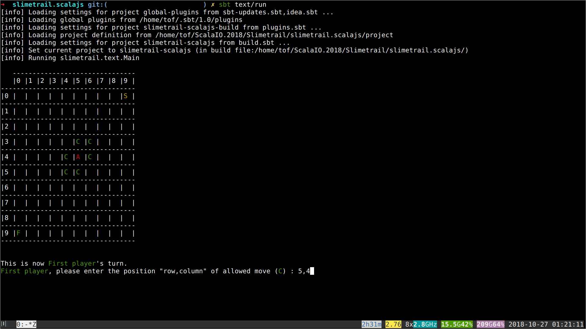

# The Slimetrail Text App

- **Recommended time to spend on this part: 5 minutes**
- **Recommended finishing before: 10:00am**

A text interface similar to the web one you used to far has been realized. To get it clone the following [git](https://git-scm.com/) repository:

```sh
git clone https://github.com/chrilves/slimetrail.scalajs.git -b ScalaIO.2018
cd slimetrail.scalajs
sbt text/run
```

You should see something like this:



The project is divided into three *sbt modules*:

- `text` implements the text user interface.
- `slimetrail` implements the game's logic.
- `toolbox` defines various useful things.

**Do not modify any file under the `toolbox`, `slimetrail` and `text` directories!!!**

Note that `text` does not include any game logic and `slimetail` does not include any interface code. This strict **isolation** is crucial to make things work.

**Run the following commands to generate the scaladoc for the** `text`, `slimetrail` **and** `text` **projects.**

- `sbt toolbox\doc`
- `sbt slimetrail\doc`
- `sbt text\doc`

**Now open the generated documentations in your browser.**

## The Game Loop

- **Recommended time to spend on this part: 10 minutes**
- **Recommended finishing before: 10:10am**

The execution of the game follows a simple and widespread technique:

- A data structure, the `GameState`, represents the possible states of the game.
- On every user `Action`, the game `update` the current state to reflect the changes made by the `Action`.
- On every state change, the game renders the new state on the screen.

More generally an application defines a type `Model` which represents the states the application can take. It also defines a type `Msg` which represents the events that make the application to transition from the current state to a new one. This new state is computed using the function `update` based on the current state `model` and the event `message`. The `view` function is responsible of rendering the current state on the screen and producing a *message* from user inputs.

All of this is summarized in the following two `trait`s which represents an application. Take a close look at how the `run` procedure works.

```scala
trait Application {
  type Model
  val initialModel: Model

  type Msg

  def update(message: Msg, model: Model): Model
}

trait TextApplication extends Application {

  def view(model: Model): Msg

  final def run(): Unit = {
    @tailrec
    def loop(model: Model): Unit = {
      val msg: Msg = view(model)
      val nextModel: Model = update(msg, model)
      loop(nextModel)
    }

    loop(initialModel)
  }
}
```

The *Slimetrail* application is implemented by the class `SlimetrailTextApp`. Note that the `Model` is `GameState` and events are `Action`.