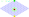

# Slimetrail

- **Recommended time to spend on this part: 5 minutes**
- **Recommended finishing before: 9:05am**

*Slimetrail* is a **two-players** **turn-based** board game. At the beginning of the game the board looks like this:

The red cell in the centre of the board is call the **stone**. Players, at their turn, move the stone to an adjacent cell. The goal of the **green player** is to put the stone in the top-most cell (the **green cell**) while the goal of the **yellow player** is to put the stone in the bottom-most cell (the **yellow cell**). The **Allowed moves** are indicated by a drawing cells in light green on first-player's turn and light yellow on second-player's one. The first player to reach his/her goal wins the game. Green player plays first.

**Visit [chrilves.github.io/slimetrail](https://chrilves.github.io/slimetrail) and take 5 minutes to play the game to get used to it.**